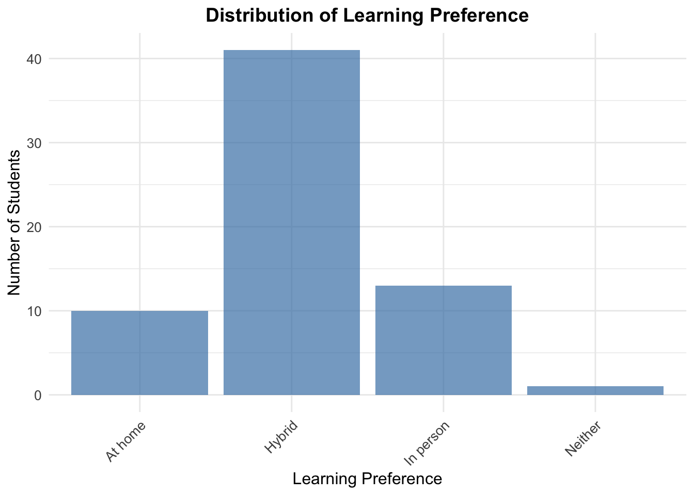
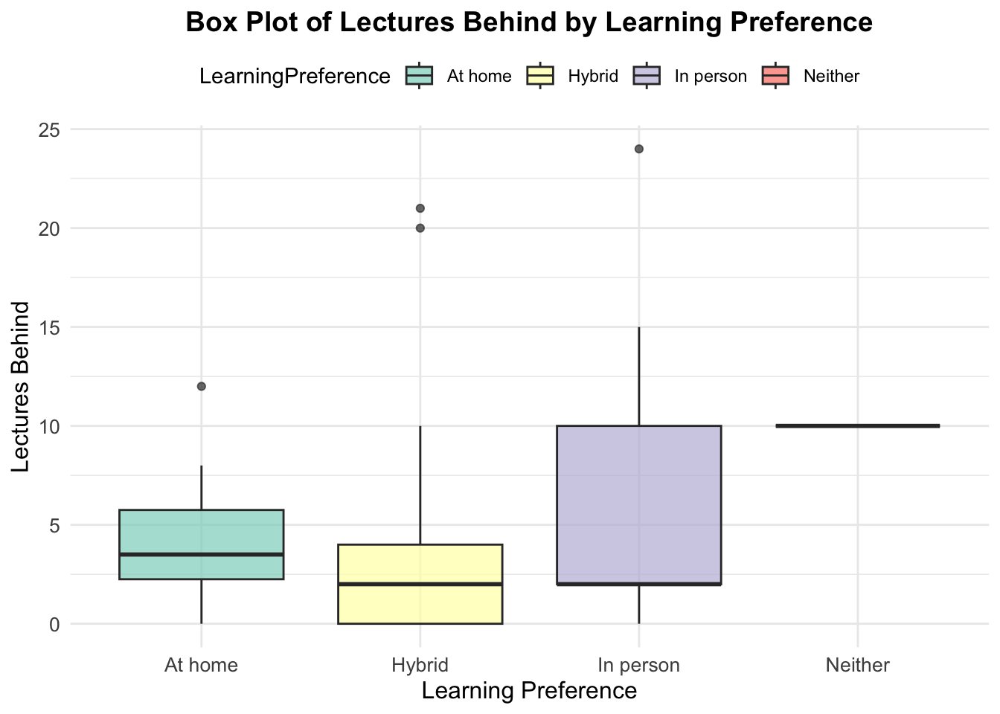
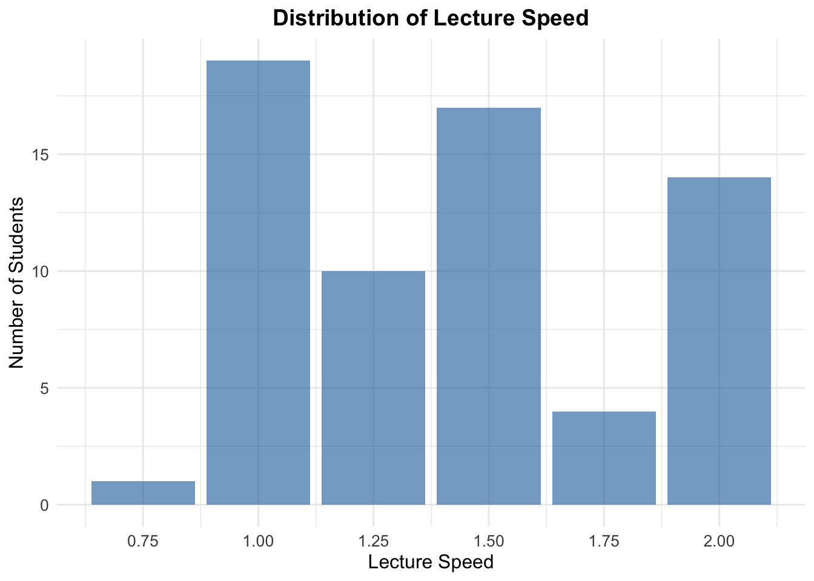
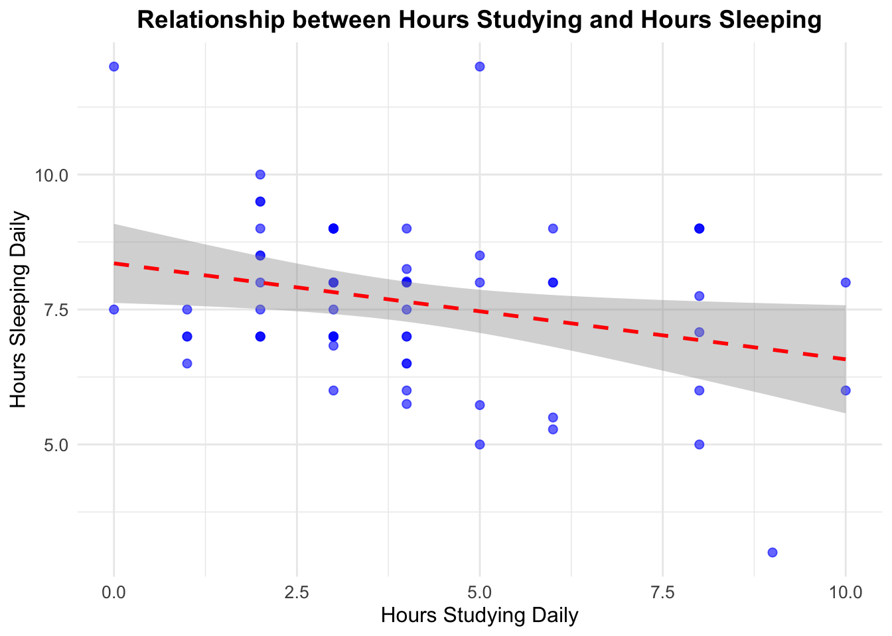
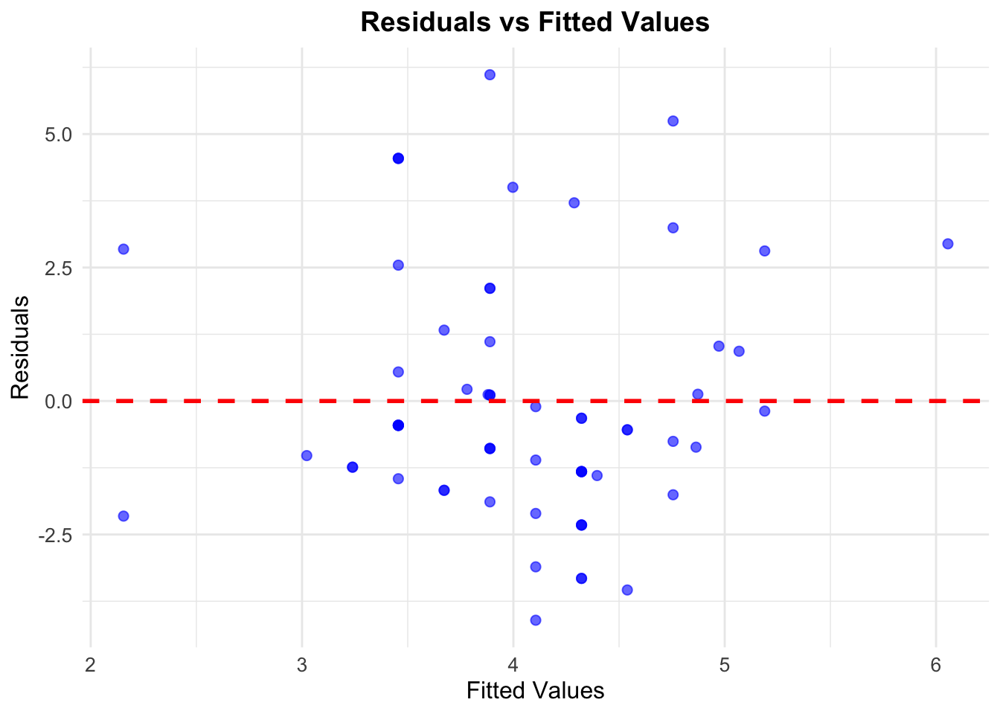

<br>

```r
library(tidyverse)
surveyResults_1 = read.csv("~/Documents/GitHub/DATA1001/DATA1001 Project responses with time - Sheet1 copy.csv")
```

## Executive Summary
- This report investigates the impact of transitioning from in-person to online lectures on students' work-life balance and performance.
- Data shows a weak positive correlation between online learning and students' ability to keep up with lectures, but no correlation with work-life balance.

## Initial Data Analysis (IDA)

### Source

The data was collected from university students from 25/3/24-9/4/24, using Google Forms (https://forms.gle/E5e7UwEpfacLxCGk8)


### Structure

There were, in total, 68 entries. There were 10 questions in our survey however using two pieces of data we created an 11th column named “HoursSleep”. Our data included Quantitative data such as LecturesBehind and qualitative data such as LearningPreference. 


```r
str(surveyResults_1)
```

```
## 'data.frame':	68 obs. of  12 variables:
##  $ Timestamp           : chr  "3/25/2024 12:45:26" "3/25/2024 13:16:58" "3/25/2024 13:21:38" "3/25/2024 14:23:29" ...
##  $ LearningPreference  : chr  "At home" "Hybrid" "Hybrid" "Hybrid" ...
##  $ CurrentLearningType : chr  "In person" "Hybrid" "Hybrid" "In person" ...
##  $ AssignmentSubmission: int  0 1 1 0 3 2 1 0 1 0 ...
##  $ LecturesBehind      : int  2 0 1 3 0 0 4 3 2 4 ...
##  $ LectureSpeed        : num  1 1.25 2 1.5 1 1.25 1 1.5 1.5 1.5 ...
##  $ WakeUp              : chr  "5:00:00 am" "7:00:00 am" "5:00:00 am" "7:15:00 am" ...
##  $ Bedtime             : chr  "10:00:00 pm" "10:00:00 pm" "11:00:00 pm" "11:00:00 pm" ...
##  $ HoursStudying       : num  1 3 8 4 4 6 20 3 2 3 ...
##  $ Extracurriculars    : num  0 1 3 0 0 1 1 2 0 3 ...
##  $ MealsDaily          : chr  "2" "5" "4" "4" ...
##  $ HoursSleep          : num  7 9 6 8.25 9 8 8 8 7.5 9 ...
```


### Limitations

Most of our participants are from USYD and are doing Data Science resulting in selection bias. We encountered recall bias as many students couldn’t recall how long they slept or how far behind they were. Consent bias means that the students who filled out this survey were willing to fill it out being a different population from the students who didn't. 


#### Assumptions

Responses making a mistake with AM and PM, there were multiple responses with ‘unrealistic’ sleeping times due to inadequate understanding between AM and PM. Going to sleep at 12PM were assumed to be mistakes made by the respondent. 


#### Data Clearing

Unrealistic responses include, someone who studied for 233333333333 hours daily and 2 more responses with exorbitant data.

These were removed using :


```r
rows_to_remove <- c(7,24,33)

surveyResults <- surveyResults_1[-rows_to_remove, ]
```


The odd-looking times were corrected in the csv file.


We added another column using excel and editing the csv file directly. We did this instead of using Rstudio due to the noticeable number of wrong inputs due to confusion around Bedtime.

## Research Theme
Due to the COVID-19 pandemic, many institutions shifted teaching and work to online formats. Our research aims to assess the impact of online versus in-person learning on students' work-life balance and academic performance.

### 2.2 Research Question 1
How well do people stay on top of work when at home or in person?

A weak positive correlation between online learning and keeping up with university work was found. Online learning, especially the option to adjust playback speed, may help students keep up by saving time. However, our data suggests a hybrid approach (45% of students) is most optimal, combining the benefits of in-person focus and online flexibility.


```r
ggplot(surveyResults, aes(x = LearningPreference)) +
  geom_bar(fill = "steelblue", alpha = 0.7) +
  labs(
    title = "Distribution of Learning Preference",  
    x = "Learning Preference", 
    y = "Number of Students" 
  ) +
  theme_minimal() + 
  theme(
    plot.title = element_text(size = 14, face = "bold", hjust = 0.5), 
    axis.title = element_text(size = 12),  
    axis.text = element_text(size = 10), 
    axis.text.x = element_text(angle = 45, hjust = 1)  
  )
```



In hybrid learning, 75% of students fall behind by fewer than 4 lectures. In contrast, 50% of in-person students fall behind by 4-10 lectures. This suggests hybrid learning can help reduce the number of lectures missed. The range of lectures missed is the smallest in online learning, indicating consistent results. In both hybrid and in-person learning, students are typically less than 2 lectures behind, though hybrid students show better performance overall.


```r
ggplot(data = surveyResults, aes(x = LearningPreference, y = LecturesBehind, fill = LearningPreference)) +
  geom_boxplot(alpha = 0.7) + 
  theme_minimal() + 
  labs(
    title = "Box Plot of Lectures Behind by Learning Preference",  
    x = "Learning Preference",  
    y = "Lectures Behind"  
  ) +
  theme(
    plot.title = element_text(size = 14, face = "bold", hjust = 0.5), 
    axis.title = element_text(size = 12),
    axis.text = element_text(size = 10),  
    legend.position = "top" 
  ) +
  scale_fill_brewer(palette = "Set3") 
```


Most students prefer watching online lectures at 1x speed, but 65% use faster speeds, gaining a time advantage. This could suggest that without online options, 65% of students might fall behind further.


```r
total_above_1 <-nrow(surveyResults %>% filter(LectureSpeed>1.0))
total <- nrow(surveyResults)
percentage = total_above_1/total *100
print(percentage)
```

```
## [1] 69.23077
```
of watch at a speed faster than 1x. This indicates that without the option to watch online 65% of students would lack that time advantage which is very important at univeristy and could suggest they would fall more lectures behind.


```r
ggplot(surveyResults, aes(x = as.numeric(LectureSpeed))) +
  geom_bar(fill = "steelblue", alpha = 0.7) +  
  labs(
    title = "Distribution of Lecture Speed", 
    x = "Lecture Speed",  
    y = "Number of Students" 
  ) +
  theme_minimal() + 
  theme(
    plot.title = element_text(size = 14, face = "bold", hjust = 0.5), 
    axis.title = element_text(size = 12),  
    axis.text = element_text(size = 10) 
  ) +
  scale_x_continuous(
    breaks = seq(
      min(as.numeric(surveyResults$LectureSpeed)),
      max(as.numeric(surveyResults$LectureSpeed)),
      by = 0.25
    )
  )
```




### Research Question 2
Does the introduction of online learning lead to a bettwer work life balance?

There is no strong correlation between university activities and healthy life habits. Correlation coefficients between -0.27 and 0.23 indicate very weak trends.

```r
ggplot(surveyResults, aes(x = HoursStudying, y = HoursSleep)) +
  geom_point(color = "blue", size = 2, alpha = 0.6) + 
  geom_smooth(method = "lm", color = "red", se = TRUE, linetype = "dashed") + 
  labs(
    title = "Relationship between Hours Studying and Hours Sleeping", 
    x = "Hours Studying Daily", 
    y = "Hours Sleeping Daily" 
  ) +
  theme_minimal() + 
  theme(
    plot.title = element_text(size = 14, face = "bold", hjust = 0.5),
    axis.title = element_text(size = 12),  
    axis.text = element_text(size = 10) 
  )
```

```
## `geom_smooth()` using formula = 'y ~ x'
```

```
## Warning: Removed 1 row containing non-finite outside the scale range
## (`stat_smooth()`).
```

```
## Warning: Removed 1 row containing missing values or values outside the scale range
## (`geom_point()`).
```




HoursSleep and HoursStudy show a weak negative correlation (-0.2775) between studying and sleep. This implies that more study time leads to less sleep for students at the University of Sydney.


```r
fit <- lm(HoursStudying ~ HoursSleep, data = surveyResults)


ggplot(fit, aes(x = .fitted, y = .resid)) +
  geom_point(color = "blue", size = 2, alpha = 0.6) + 
  geom_hline(yintercept = 0, color = "red", linetype = "dashed", size = 1) + 
  labs(
    title = "Residuals vs Fitted Values", 
    x = "Fitted Values", 
    y = "Residuals"  
  ) +
  theme_minimal() + 
  theme(
    plot.title = element_text(size = 14, face = "bold", hjust = 0.5),  
    axis.title = element_text(size = 12), 
    axis.text = element_text(size = 10) 
  ) 
```

```
## Warning: Using `size` aesthetic for lines was deprecated in ggplot2 3.4.0.
## ℹ Please use `linewidth` instead.
## This warning is displayed once every 8 hours.
## Call `lifecycle::last_lifecycle_warnings()` to see where this warning was
## generated.
```



The residual plot of HoursSleep versus HoursStudy shows a random spread of points, suggesting a linear model is appropriate for this data.

Conclusion:
No strong correlation exists between university activities and healthy habits due to low correlation coefficients. The weak negative correlation between studying and sleep suggests students who study more tend to sleep less. The data follows a linear model, as indicated by the random spread of residual plot points. 


## Articles


1: https://www.ncbi.nlm.nih.gov/pmc/articles/PMC8910686/
2: https://www.ijiet.org/vol12/1696-IJIET-4643.pdf

Article 1 : Yu-Hsiu Chu and Yao-Chuen Li’s study (2022)  explored that online lectures and learning did not have any significant increase in psychological distress during the transition from in person learning to a hybrid or fully online learning climate.

Article 2: Another study by Chee Leong Lim (2022), which offered insights into how modifying the way online content is delivered can instead have a more positive effect on students.


## References
Chu, Y. H. (2022). The impact of online learning on physical and mental health in university students during the COVID-19 pandemic [Master’s thesis, China Medical University]. National Library of Medicine. http://www.ncbi.nlm.nih.gov/pmc/articles/PMC8910686/

Chee Leong, L., Long, S., & Nurhanim, H. (2022). The impact of live lectures and pre-recorded videos on students‟ online learning satisfaction and academic achievement in a Malaysian private university [Master’s thesis, Malaysia Private University]. International Journal of Information and Education Technology. http://www.ijiet.org/vol12/1696-IJIET-4643.pdf


## Acknowledgements
- 29/02/2024 4pm-5pm (Zoom) 
- 07/03/2024 3pm-4pm (Zoom) 
- 16/04/2024 (Class)

- Karthik – Data plotting, Google form, Articles section
- Paras – Data cleaning, Assumptions and Data cleaning section
- Caleb – Data analysis, Organising
- Leon – Presentation
- Josh – Presentation, Executive summary section, Contact creator
- Ella – Team leader, Organising, Data Plotting, Data Analysis


